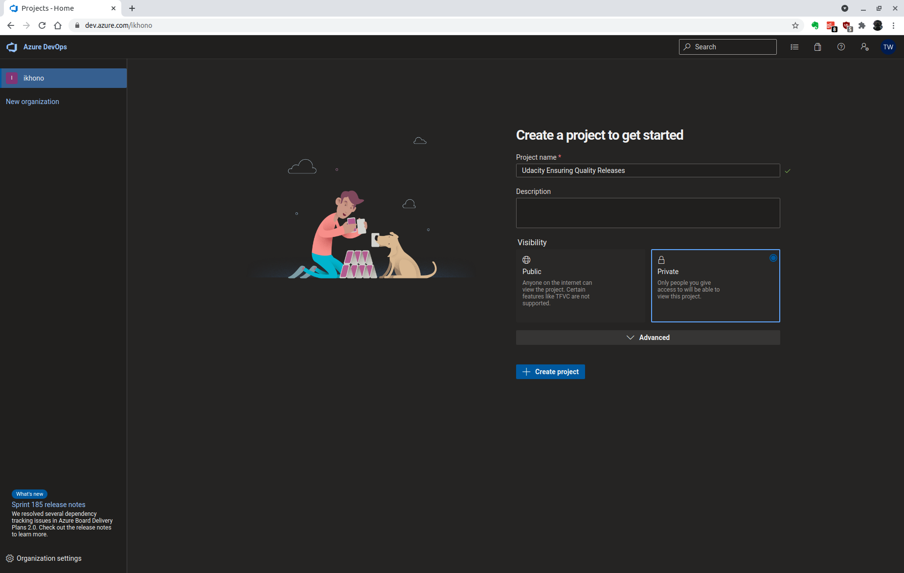

# Udacity Cloud DevOps using Microsoft Azure Nanodegree Program - Project: Ensuring Quality Releases

- [Introduction](#introduction)
- [Getting Started](#getting-started)
- [Dependencies](#dependencies)
- [Instructions](#instructions)
  - [Login with Azure CLI](#login-with-azure-cli)
  - [Configure the storage account and state backend](#configure-the-storage-account-and-state-backend)
  - [Configuring Terraform](#configuring-terraform)
  - [Executing Terraform](#executing-terraform)
  - [Setting up Azure DevOps](#setting-up-azure-devops)
  - [Configuring the VM as a Resource](#configuring-the-vm-as-a-resource)
  - [Adding service connection](#adding-service-connection)
  - [Create a Service Principal for Terraform](#create-a-service-principal-for-terraform)
  - [Run the pipeline](#run-the-pipeline)
  - [Configure Azure Monitor](#configure-azure-monitor)
  - [Configure Azure Log Analytics](#configure-azure-log-analytics)
- [Clean-up](#clean-up)
- [Screenshots](#screenshots)
  - [Environment creation & deployment](#environment-creation--deployment)
    - [Terraform](#terraform)
    - [Azure Pipeline](#azure-pipeline)
  - [Automated testing](#automated-testing)
    - [Postman](#postman)
    - [Selenium](#selenium)
    - [JMeter](#jmeter)
  - [Monitoring & observability](#monitoring--observability)
    - [Azure Monitor](#azure-monitor)
    - [Azure Log Analytics](#azure-log-analytics)
- [References](#references)
- [Requirements](#requirements)
- [License](#license)

## Introduction

This project uses Microsoft Azure and a variety of industry leading tools to create disposable test environments and run a variety of automated tests with the click of a button. Additionally it monitors and provides insight into the application's behavior, and determines root causes by querying the application’s custom log files.

## Getting Started

1. Fork this repository
2. Ensure you have all the dependencies
3. Follow the instructions below

## Dependencies

The following are the dependencies of the project you will need:

- Create an [Azure Account](https://portal.azure.com)
- Install the following tools:
  - [Azure command line interface](https://docs.microsoft.com/en-us/cli/azure/install-azure-cli?view=azure-cli-latest)
  - [Terraform](https://www.terraform.io/downloads.html)
  - [JMeter](https://jmeter.apache.org/download_jmeter.cgi)
  - [Postman](https://www.postman.com/downloads/)
  - [Python](https://www.python.org/downloads/)
  - [Selenium](https://sites.google.com/a/chromium.org/chromedriver/getting-started)

## Instructions

### Login with Azure CLI

Firstly, login to the Azure CLI using:

```bash
az login
```

### Configure the storage account and state backend

Terraform supports the persisting of state in remote storage. See [Tutorial: Store Terraform state in Azure Storage](https://docs.microsoft.com/en-us/azure/developer/terraform/store-state-in-azure-storage) for details or follow the instructions below.

Firstly, execute the `create-tf-storage.sh` script:

```bash
bash create-tf-storage.sh
```

Update `terraform/main.tf` with the Terraform storage account and state backend configuration variables:

- `storage_account_name`: The name of the Azure Storage account
- `container_name`: The name of the blob container
- `key`: The name of the state store file to be created

```bash
terraform {
  backend "azurerm" {
    resource_group_name  = "tstate"
    storage_account_name = "tstate00000"
    container_name       = "tstate"
    key                  = "terraform.tfstate"
  }
}
```

### Configuring Terraform

Rename `terraform/environments/test/terraform.tfvars.example` to `terraform.tfvars` and update the following values as required:

```bash
# Resource Group/Location
location = "East US"
resource_group = "udacity-ensuring-quality-releases-rg"
application_type = "WebApp"

# Network
virtual_network_name = "udacity-ensuring-quality-releases-vnet"
address_space = ["10.5.0.0/16"]
address_prefix_test = "10.5.1.0/24"
```

### Executing Terraform

Terraform creates the following resources for a specific environment tier:

- App Service
- App Service Plan
- Network
- Network Security Group
- Public IP
- Resource Group
- Linux VM

You can use the following commands to create the infrastructure:

```bash
cd terraform/environments/test
terraform init
terraform plan -out solution.plan
terraform apply solution.plan
```

### Setting up Azure DevOps

Create a free [Azure DevOps account](https://azure.microsoft.com/en-us/services/devops/) if you haven't already and install the [Terraform Extension for Pipelines](https://marketplace.visualstudio.com/items?itemName=ms-devlabs.custom-terraform-tasks).

Create a new project:



Create a new pipeline:


Select GitHub and then your GitHub repository:


Configure your pipeline by choosing "Existing Azure Pipelines YAML File" and select the `azure-piplines.yaml` file in the menu that pops out on the right:


On the Review page, update the Terraform storage account name:

```yaml
backendAzureRmStorageAccountName: "tstate5275"
```

Add a new variable for the storage account access key:


Use the drop down arrow next to "Run" and select "Save". Don't run the pipeline just yet.

Upload your `terraform.tfvars` file as a secure file so you can use it in the pipeline:


See [here](https://docs.microsoft.com/en-us/azure/devops/pipelines/library/secure-files) for more information.

### Configuring the VM as a Resource

Click on Environments and you should see an environment named Test. Click on it.


Once inside the environment, click on Add resource and select Virtual Machine.


Select Linux as the OS. You'll then need to copy the registration script to your clipboard and run this on the VM terminal.


You can skip entering environment VM resource tags by inputting `N`. If everything was successful, you should see this output from the connection test:


Back on Azure DevOps portal in Environments, you can close out the Add resource menu and refresh the page. You should now see the newly added VM resource listed under Resources.

### Adding service connection

Go to project settings and then to service connections:


Click on "New service connection" and select "Azure Resource Manager"


Select "Service principal (automatic)":


Name the connection "terraform-sa" and create the new service principal:


### Create a Service Principal for Terraform

A Service Principal is an application within Azure Active Directory whose authentication tokens can be used as the `client_id`, `client_secret`, and `tenant_id` fields needed by Terraform (`subscription_id` can be independently recovered from your Azure account details). See [Azure Provider: Authenticating using a Service Principal with a Client Secret](https://registry.terraform.io/providers/hashicorp/azurerm/latest/docs/guides/service_principal_client_secret) for details or follow the instructions below.

Get the subscription ID:

```bash
az account list
```

Select the `id` field of the subscription you would like to use.

Should you have more than one Subscription, you can specify the Subscription to use via the following command:

```bash
az account set --subscription="SUBSCRIPTION_ID"
```

Now we can create the service principal which will have permissions to manage resources in the specified Subscription using the following command:

```bash
az ad sp create-for-rbac --role="Contributor" --name="terraform-sa" --scopes="/subscriptions/SUBSCRIPTION_ID"
```

This command will output 5 values:

```json
{
  "appId": "00000000-0000-0000-0000-000000000000",
  "displayName": "azure-cli-2017-06-05-10-41-15",
  "name": "http://azure-cli-2017-06-05-10-41-15",
  "password": "0000-0000-0000-0000-000000000000",
  "tenant": "00000000-0000-0000-0000-000000000000"
}
```

These values map to the Terraform variables like so:

- `appId` is the `client_id` defined above.
- `password` is the `client_secret` defined above.
- `tenant` is the `tenant_id` defined above.

Update your `terraform.tfvars` and store those values:

```bash
# Azure subscription vars
subscription_id = "00000000-0000-0000-0000-000000000000"
client_id = "00000000-0000-0000-0000-000000000000"
client_secret = "0000-0000-0000-0000-000000000000"
tenant_id = "00000000-0000-0000-0000-000000000000"
```

### Run the pipeline

Go to the pipelines overview


Run the new pipeline:


### Configure Azure Monitor

TBD

### Configure Azure Log Analytics

TBD

## Clean-up

Destroy the Terraform resources:

```bash
cd terraform
terraform destroy
```

Delete the Azure DevOps project from the project settings:


## Screenshots

### Environment creation & deployment

#### Terraform

Screenshot of the log output of Terraform when executed by the CI/CD pipeline:


#### Azure Pipeline

Screenshot of the successful execution of the pipeline build results page:


### Automated testing

#### Postman

Three screenshots of the Test Run Results from Postman shown in Azure DevOps. One should be the Run Summary page (which contains 4 graphs), one should be of the Test Results page (which contains the test case titles from each test) and one should be of the output of the Publish Test Results step.

TBD

#### Selenium

A screenshot of the successful execution of the Test Suite on a VM in Azure DevOps should contain which user logged in, which items were added to the cart, and which items were removed from the cart.

TBD

#### JMeter

A screenshot of the log output of JMeter when executed by the CI/CD pipeline (ensure the timestamp is visible by toggle timestamps for the specific job) should contain the lines that start with “summary” and “Starting standalone test @”.

TBD

### Monitoring & observability

#### Azure Monitor

Screenshots of the email received when the alert is triggered, the graphs of the resource that the alert was triggered for (be sure to include timestamps for the email and the graphs), and the alert rule, which will show the resource, condition, action group, alert name, and severity. Screenshots for the resource’s metrics will correspond to the approximate time that the alert was triggered.

TBD

#### Azure Log Analytics

Screenshots of log analytics queries and result sets which will show specific output of the Azure resource. The result set will include the output of the execution of the Selenium Test Suite (be sure to include timestamps).

TBD

## References

- [Tutorial: Store Terraform state in Azure Storage](https://docs.microsoft.com/en-us/azure/developer/terraform/store-state-in-azure-storage)
- [Azure Provider: Authenticating using a Service Principal with a Client Secret](https://registry.terraform.io/providers/hashicorp/azurerm/latest/docs/guides/service_principal_client_secret)
- [Create your first pipeline](https://docs.microsoft.com/en-us/azure/devops/pipelines/create-first-pipeline)
- [Automating infrastructure deployments in the Cloud with Terraform and Azure Pipelines](https://azuredevopslabs.com/labs/vstsextend/terraform/)
- [Terraform on Azure Pipelines Best Practices](https://julie.io/writing/terraform-on-azure-pipelines-best-practices/)
- [Use Terraform to manage infrastructure deployment](https://docs.microsoft.com/en-us/azure/devops/pipelines/release/automate-terraform)

## Requirements

Graded according to the [Project Rubric](https://review.udacity.com/#!/rubrics/2843/view).

## License

- **[MIT license](http://opensource.org/licenses/mit-license.php)**
- Copyright 2021 © [Thomas Weibel](https://github.com/thom).
